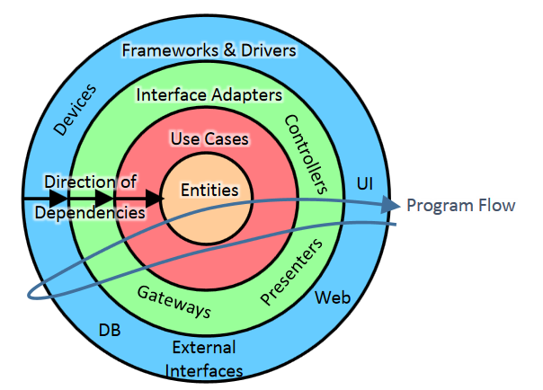

## Методические указания PHP

### Предисловие

Здесь будет описан набор стратегий/рекомендаций, которые позволяют масштабировать команду разработки и структурировать проект. 
Для достижения масштабирования команды ставиться всего две цели, порождающие процесс, необходимо писать код как один разработчик и писать документацию так, чтоб ее понимал человек, пришедший с улицы.
Эти цели недостижимы. Они ставятся для порождения процесса, улучшающего понимание проекта в команде. 

Перед внедрением каких-либо процессов необходимо провести экспертный анализ. 
Если на проекте код находится на физическом сервере или VPS, код на сервер доставляется пуллом с репозитория актуальной версии проекта или прямой доставкой приложения по SSH. 
А архитектура проекта заканчивается на MVC.
В таком случае категорически не рекомендуется пытаться все перевести на микросервисы, которые будут крутиться в kubernetes в облаке за одну итерацию.
На проекте работают люди, и при внедрении актуальных инструментов, архитектурных решений и сервисов, есть риск столкнуться с непониманием и не принятием со стороны команды. 
Проект должен прожить все этапы развития. Сколько времени займет создание процесса и внедрение новых инструментов зависит только от команды.  

Команда не однородна. Ориентиром окончания внедрения процесса можно считать когда 80% команды следует выстроенному процессу.
Внедрение новой технологии порождает/изменяет/накладывает ограничения на процесс работы. 
Перед внедрением нужно провести анализ готовности команды.

### Базовые понятия и логика применения теоритических знаний

- Как писать код? Базовые подходы к написанию кода
    - [Функциональное программирование](./architecture/functional-programming.md)
    - [Объектно-ориентированное программирование](./architecture/oop.md)
- Куда писать код? Структуризация проекта 
    - [GRASP](./architecture/grasp.md)
    - [SOLID](./architecture/solid.md)
    - [Паттерны проектирования](./architecture/design-patterns.md)

### Введение

В первую очередь командой преследуется цель оперативного решения проблем связанных с бизнес процессом. По этому весь код должен быть написан согласно [PSR-4](https://github.com/php-fig/fig-standards/blob/master/accepted/PSR-4-autoloader-examples.md) и [Чистый код](https://github.com/3xter/clean-code-php). Еcли нет уверенности, что вы пишете читабельный код посоветуйтесь с соседом рядом. Не обязательно это должен быть кто-то из команды. Придерживаемся правила: "Если два человека поняли написанное, третий с большой вероятностью тоже поймет".

Первые проблемы начинаются с неявно описанных тасков и плохо спроектированной базы. Если при прочтении таска у вас возникли вопросы в первую очередь пишем их в таск комментарием, обращаемся к ПМ-у. Часто бывают ситуации, когда уточнение задачи вы обсуждаете напрямую с постановщиком. Если такое случается берем за правило оповестить ПМ-а про изменения/уточнения. Просим постановщика подправить сам таск или даже просто в таск скинуть переписку в которой вы решили непонятные моменты. В таске обязательно должны быть зафиксированы все уточнения и/или изменения задачи. Это может привести к переэстимейту таска.

Что делать с существующей базой? Если вам не понятна структура базы или логика работы обращаемся к тим лиду. Он или подскажет или направит к человеку, который разрабатывал функционал и/или знает ответы на ваши вопросы. Советуем визуализировать часть таблиц, с которой вы работаете. Делаем это в [https://oino.uno/db-architecture](https://oino.uno/db-architecture) или [https://www.dbdesigner.net/](https://www.dbdesigner.net/) Описанную структуру можно закинуть в таск комментарием. Это может помочь вам в будущем при переоткрытии таска через время, или другому человеку при выполнении связанных тасков. Так же описанная структура таблиц может лечь в основу документации к функционалу.

Что делать если логика, которая описана в таске не совпадает с реализацией в проекте? Это зачастую связанно со старым функционалом. Особенно если постановщик больше не работает в компании, и его функционал отдали другому человеку. В таком случае необходимо сообщить об этом ПМ-у, отписать в таск. Дальше действовать по ситуации.

Для понимания бизнес логики старой/новой желательно ее визуализировать [https://oino.uno/diagrams](https://oino.uno/diagrams) или [https://app.diagrams.net](https://app.diagrams.net/) Блок-схема не обязана совпадать полностью с написанным кодом. Она должна визуализировать бизнес логику. В дальнейшем эта схема может так же стать фундаментом для документации.

Нужно ли писать документацию? Документация нужна только для функционала, который имеет сложную для понимания логику, которую необходимо визуализировать. Что такое "сложная логика"? Если у вас начали появляться вопросы при реализации/рефакторинге/доработке как функционал должен работать. Тогда в обязательном порядке должна появиться страница в Confluence с описанием структуры базы и блок-схемой бизнес логики как минимум. Страницу вам заводит ПМ. В документации должно быть меньше слов, больше визуальных схем с описанием. Легче воспринимать информацию визуально чем через полотна текста.

Документация должна состоять из двух блоков. Вы описываете тех. документацию. Так же просите постановщика через ПМ-а описать пользовательскую документацию, в которой должно описываться: зачем создан функционал, как с ним работать (желательно скриншотами) с точки зрения пользователя (UX). Вы должны описать как это должно работать, постановщик - как с этим работать.

#### Используемые концепции

В команде преследуется цель писать как один разработчик. Что это означает? Эмпирическим путем выявлены принципы и рекомендации, которые работают в рамках общей системы и позволяют писать в одном стиле всей команде. За основу взяты: документация Symfony, SOLID и DDD.

#### С Domain Driven Design берем концепт реализации функционала:

Написанный код должен иметь смысл не только для программистов, но и для бизнеса. Программист и постановщик должны говорить на "одном языке". Все сущности и свойства должны называться так, как их называет постановщик. Если это Возвраты, то это Refund, если это Заказ, то это Order. По возможности составлять глоссарии, и описывать сущности.

Приоритеты программиста должны соответствовать бизнес-приоритетам.

Программист должен выступать в роли переводчика с языка постановщика на язык программирования.

Также придерживаемся принципа "слоеного пирога". Разграничиваем зоны ответственности и связываем каждую зону при помощи dependency injection (DI).


#### Используется из SOLID:

The Single Responsibility Principle Сервис должен иметь только одну обязанность. Спокойно реализуется в наших условиях. Как при рефакторинге, так и при разработке нового функционала.

The Dependency Inversion Principle Сервисы верхних уровней не должны зависеть от сервисов нижних уровней. Оба типа сервисов должны зависеть от абстракций. Абстракции не должны зависеть от деталей. Детали должны зависеть от абстракций.

The Interface Segregation Principle Лучше иметь много интерфейсов под конкретные реализации, чем один универсальный. Если есть необходимость в написании unit тестов этому принципу необходимо следовать. В проекте нет необходимости писать под каждый класс интерфейс.


The Liskov Substitution Principle  Замещения - если S является подтипом T, тогда объекты типа T в программе могут быть замещены объектами типа S без каких-либо изменений желательных свойств. Частично выполним, зависит от реализации.

#### Не используется из SOLID:

The Open Closed Principle Класс открыт для расширения закрыт для модификации. Самая большая проблема: не факт что кто-то из другой команды следует принципам SOLID. В проетах где работает 10+ человек стожно поддерживать версионность обектов.

Используем Dependency Injection для того, чтоб убрать связи Контроллеров с Сервисами и Репозиториями и для уменьшения связанности кода.

### Общая схема реализации функционала

На основе MVC строим базовую архитектуру: 

Сервис - это класс, который реализует бизнес логику.

Репозиторий -  это класс, который управляет хранилищами данных (MySQL, MongoDB, ClickHouse) В нём пишем все запросы к базам

Сущность - это класс, описывающий структуру баз данных.

Трансформер - класс, преобразующий конечный результат для дальнейшей передачи.

Для того, чтоб связать Контроллер, Сервис и Репозиторий между собой используем ValueObject. ValueObject так же обьединяет в себе и понятие DTO для уменьшения кол-ва сущностей. Зачастую DTO при изменениях бизнеслогики часто перетикает в ValueObject.

## Общая схема взаимодействия

### Запрещено/разрешено/требуется использовать в Domain

В Domain запрещено использовать ORM модели. Вместо них используем Entity для хранения и Repository для написания запросов к базе. И для бизнес связей Entity между собой используем Aggregate 

В Service методах на вход нужно принимать явные переменные типа int/string/float/bool так же обьекты Entity/ValueObject/Aggregate

Запрещается писать Controller в котором реализовано несколько методов. Пишем один route - один Controller

Запрещено в Controller, который реализует бизнес логику из Domains, принимать базовый Request.

В проектах запрещено использовать trait.
Запрещено обращатся к контейнеру напрямую (исключение - сервис провайдера и фабрики)

#### Структура проекта

---- src/  
---- ---- ExampleDomain/  
---- ---- ---- [Aggregates/](#aggregates)  
---- ---- ---- [Constants/](#constants)  
---- ---- ---- [Entities/](#entity)  
---- ---- ---- [Exceptions/](#exceptions)  
---- ---- ---- [Repositories/](#repository)  
---- ---- ---- [Services/](#services)  
---- ---- ---- [ValueObjects/](#dto-и-valueobject)  
---- ---- ExampleInfrastructure/  
---- ---- ---- Commands/  
---- ---- ---- Controllers/  
---- ---- ---- EventListeners/  
---- ---- ---- Requests/  
---- ---- ---- Responses/  

### Entity

Entity (Сущность) - определяет некоторую сущность в бизнес логике и обязательно имеет идентификатор(уникальный ключ. Ключ может быть выражен как id/guid/uuid так и совокупностью свойств(составной уникальный ключ), которые будут идентифицировать entity.), по которому Entity можно найти или сравнить с другой Entity. Если две Entity имеют идентичный идентификатор — это одна и та же Entity. Практически всегда изменяем.

```php
<?php
namespace App\BrandDomain\Entities;

use Doctrine\ORM\Mapping\Entity;
use Doctrine\ORM\Mapping\Table;
use Symfony\Component\Uid\Uuid;
use Doctrine\ORM\Mapping as ORM;
use Doctrine\ORM\Mapping\UniqueConstraint;

/**
 * @Entity
 * @Table(name="brands")
 */
class BrandEntity
{
    /**
     * @ORM\Id()
     * @ORM\Column(type="uuid")
     */
    private Uuid $guid;

    public function __construct(
        /**
         * @ORM\Column(length: 140)
         */
        private readonly int $name,
    ) {
        $this->guid = Uuid::v4();
    }

    public function getGuid(): Uuid
    {
        return $this->guid;
    }
}
```

### DTO и ValueObject

Data Transfer Object(DTO) -  это обьект, структура данных, которая переносит информацию между процессами (Контроллерами, Сервисами, Репозиториями). Желательно не изменять уже засеченые свойства, чтоб избавиться от неявной логики. Он не имеет зависимостей. В нем находятся только типизированные свойства и геттеры с сеттерами. Никаких логических действий в этом обьекте не может быть. Зачастую используется для подбрасывания в сервисы и репозитории фильтров с контроллера.

Зачем пробрасывать обьект, а не просто указать в методе екзекюторе типизированную переменную? При поддержке функционала, кол-во кода и фич увеличивается. Максимальное кол-во переменных, прокинутых в метод, должно быть максимум 5. Если сервис часто используется в разных функционалах, каждый вызов необходимо будет переписывать. Это не правильно. Прокидывание в екзекютор сервиса или метод репозитория обьекта сохранит структуру кода.

Value Object - это иммутабельный тип, значение которого задается при создании и не меняется на протяжении всей жизни объекта. Не имеет идентификатора. Могут содержать логику (валидацию, реализовывать интерфейсы  \JsonSerializable, Arrayable, \Countable\Serializable и т д) и обычно они не используются для передачи информации между приложениями. Они используются внутри сервисов для работы с сущностными. Их можно отдавать как результат выполнения сервиса. Если два Value Object структурно одинаковы — они эквивалентны. Можно писать методы проверки и фильтровать данные. к примеру isEmpty, equals, sanitizedName.
```php
<?php
namespace App\BrandDomain\ValueObjects;

final class BrandCreatorObject
{
    public function __construct(
        public readonly string $brandName,
    ) {}
}
```

### Aggregates 

Aggregate(Агрегат) - использование агрегатов позволяет избегать чрезмерного соединения объектов между собой, составляющих модель. Это позволяет избежать путаницы и упростить структуру, потому что не позволяет создавать тесно связанные системы.

Вместо того, чтоб не добавлять лишние связи в сущность, и потом не создавать к примеру лишнюю сущность без связей.

```php
<?php
namespace App\BrandDomain\Aggregates;

use \App\BrandDomain\Entities\BrandEntity;
use \App\BrandDomain\ValueObjects\BrandCreatorObject;

final class BrandCreatorAggregate
{
    public function __construct(
        public readonly BrandEntity $brandEntity,
        public readonly BrandCreatorObject $brandCreatorObject,
    ) {}
}
```

### Constants 

Constant - это обычный класс с константами. Все всегда сталкиваются с регулярными выражениями, id статусов, и т.д. Теперь все константы выносим в отдельные классы для переиспользования.

```php
<?php
namespace App\BrandDomain\Constants;

final class DbConst
{
    const BRANDS = 'brands';
}
```

### Exceptions 

Exceptions - хранит в себе именные ошибки. Не выкидывайте дефолтный ексепшн, если необходимо выкинуть ошибку - выкидывайте кастомную ошибку. Использовать их можно и нужно везде Repositories, Services, etc..
```php
<?php
namespace App\BrandDomain\Exceptions;

final class BrandCreatorException extends \Exception
{
}
```

### Dependency injection

Dependency injection (DI) - это стиль настройки объекта, при котором поля объекта задаются внешней сущностью. Другими словами, объекты настраиваются внешними объектами. DI — это альтернатива самонастройке объектов. 

### Repository

Репозиторий - это классы, которые представляют собой коллекции объектов. Они не описывают хранение в базах данных или кэширование или решение любой другой технической проблемы. Репозитории представляют коллекции. Как мы храним эти коллекции — это просто деталь реализации. В репозиториях мы пишем все запросы к базам MySQL, MongoDB, ClickHouse и т. д. В репозиториях не реализуем методы удаления/редактирования/создания сущностей. Используем для этого UnitOfWork.
```php
<?php
namespace App\BrandDomain\Repositories;

use App\BrandDomain\ValueObjects\BrandFilterObject;
use App\BrandDomain\ValueObjects\BrandObject;
use Doctrine\DBAL\Connection;
use App\BrandDomain\Constants\DbConst;
use Symfony\Component\Uid\Uuid;

final class BrandRepository
{
    public function __construct(
        private Connection $connection;
    ) {
    }

    // пример получения одного обьекта 
    public function getBrandByGuid(Uuid $guid): BrandObject
    {
        $builder = $this->connection->createQueryBuilder();
        $brand = $builder->select([
                'guid',
                'name',
            ])
            ->from(DbConst::BRANDS)
            ->andWhere("guid = {$builder->createNamedParameter($guid->toString())}")
            ->fetchAssociative();

            return new BrandObject(
                Uuid::fromString($brand['guid']),
                $brand['name'],
            );
    }

    // пример получения листа  
    public function getBrandsByFilter(BrandFilterObject $filter): \Generator
    {
        $builder = $this->connection->createQueryBuilder();
        $query = $builder->select([
                'guid',
                'name',
            ])
            ->from(DbConst::BRANDS);
        ...
        foreach ($query->executeQuery()->iterateAssociative() as $brand) {

            yield new BrandObject(
                Uuid::fromString(brand['guid']),
                $brand['name'],
            );
        }
    }
    
    // пример проверки на существование
    public function isExistByName(string $name): bool
    {
        $builder = $this->connection->createQueryBuilder();
        $guid = $builder->select([
            'guid',
        ])
            ->from(DbConst::BRANDS)
            ->andWhere("name = {$builder->createNamedParameter($name)}")
            ->fetchFirstColumn();

        return !empty($guid);
    }
}
```

### UnitOfWork 

UnitOfWork [паттерн](https://martinfowler.com/eaaCatalog/unitOfWork.html) используется в Service для сохранения/редактирования/удаления всех сущностей в рамках одной транзакции. Пример реализации [Entity Manager у Doctrine](https://symfony.com/doc/current/doctrine.html)

### Services 

Service(Сервис) - это класс/классы, которые реализуют бизнес логику, и взаимодействуют с сущностями. Реализация сервиса зависит от кейсов. В сервисах можно реализовывать собственную архитектуру. Реализовывать паттерны. Использовать дополнительные сущности. Создаем их в рамках сервиса и используем там же. На выходе из сервиса все же получать описанные здесь сущности Entity/Aggregate/ValueObject
```php
<?php
namespace App\BrandDomain\Services\Create;

use App\BrandDomain\ValueObjects\BrandCreatorObject;
use App\BrandDomain\Aggregates\BrandCreatorAggregate;
use App\BrandDomain\Repositories\BrandRepository;
use App\BrandDomain\Exceptions\BrandCreatorException;
use Doctrine\ORM\EntityManagerInterface;

final class BrandCreator
{
    public function __construct(
        private readonly BrandRepository $brandRepository,
        private readonly EntityManagerInterface $entityManager,
    ) {}

    public function create(
        BrandCreatorObject $brandCreatorObject,
    ): BrandCreatorAggregate
    {
        if ($this->brandRepository->isExistByName($brandCreatorObject->brandName)) {
            throw new BrandCreatorException("Brand exist");
        }
        $brand = new BrandEntity($brandCreatorObject->brandName);

        $this->entityManager->persist($brand);

        return new BrandCreatorAggregate(
            $brand,
            $brandCreatorObject,
        );
    }
}
```

### Коллекции

Советуюем использовать реализацию [https://github.com/ramsey/collection](https://github.com/ramsey/collection) так как они типизированы. По возможности не использовать массивы.

## Автоматизация проверки архитектуры

Для автоматизации проверки советуем испольозвать в проектах [deptrac](https://github.com/qossmic/deptrac) и [psalm](https://github.com/vimeo/psalm) на 3 уровне. Проверять ее на каждой пушнутой ветке в репозиторий при помоши экшена.